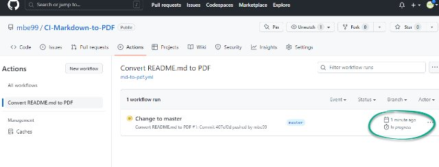
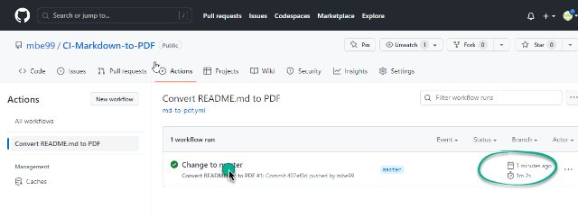
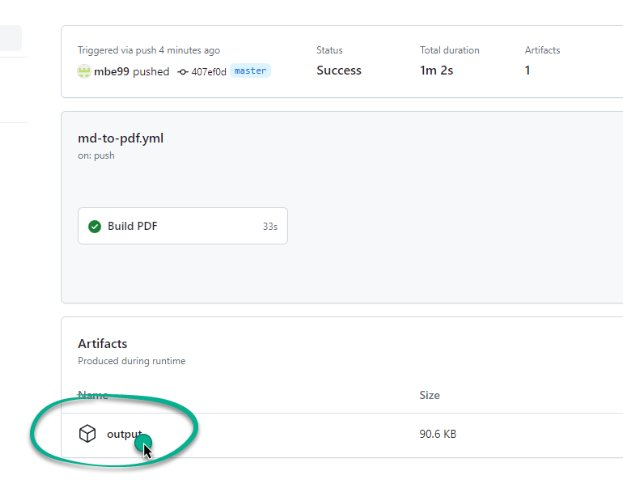

# automatisch PDF Files nach GIT-Push erstellen

Einfaches Beispiel wie nach einem GIT-Push automatisch ein PFD File aus dem README.md erstellt wird.

In Github sind die CI-Pipelines unter Àctions` definiert


Einen Workflow (Pipeline) erstellen


Der Code dazu

```
name: Convert README.md to PDF

on:
  label:
    types:
      - created
  push:
    branches:
      - master
  page_build:

jobs:
  converttopdf:
    name: Build PDF
    runs-on: ubuntu-latest
    steps:
      - uses: actions/checkout@v3

      - name: Build book
        run: |-
          npm install -g md-to-pdf
          mkdir -p _output
          cat README.md | md-to-pdf > _output/README-MD.pdf
      
      - uses: actions/upload-artifact@v1
        with:
          name: output
          path: _output
```

Pipeline ist nach `Push` aktiv



Pipeline wurde erfolgreich ausgeführt



Output kann als ZIP-Datei heruntergeladen werden




